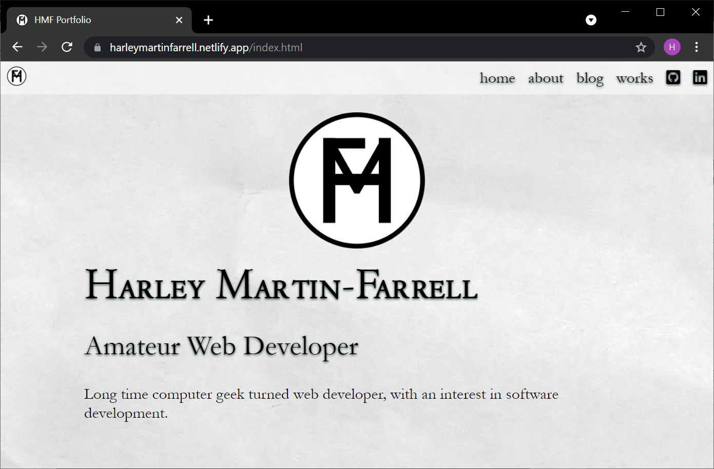

A link (URL) to your published portfolio website

  

A link to your GitHub repo

  

Description of your portfolio website, including,

  

Purpose

  

Functionality / features

  

Sitemap

  

Screenshots

  

Target audience

  

Tech stack (e.g. html, css, deployment platform, etc)

  

  

# Harley Martin-Farrell Portfolio

  

  

## Links

[live site](https://xenodochial-turing-b59360.netlify.app/)

[github](https://github.com/harley-ca)

  

## Purpose

  

The purpose of the portfolio site is to exhibit and display my abilities in website design, and create a site for the Portfolio assessment for Coder Academy. In addition, I will be able to use and modify this website to showcase other projects and assessments I complete in the future.

  

## Functionality & Features

  

My website is built with a mobile first design that utilises responsive design to provide a good experience for users on any device.

  

One of my favourite features of the site, is a floating hamburger menu style navigation bar, used exclusively on mobile devices. It uses a tiny bit of javascript to toggle the rest of the buttons to be shown via css, which drop down using the transform translate function of css.

  

After developing that feature, I found that it was difficult to scale for larger devices, and decided to replace it with a navigation menu in a subtle header for larger devices, and even smaller devices if they are turned landscape.

A late addition to the website was a "back to top" button on longer pages. I was pleasantly surprised that while developing this feature nothing went wrong, and total time for implementation was under 15 minutes.

In the future, I would like to add a "dark mode" feature, that would allow users to change the entire site to a dark colour scheme. 
  

## Sitemap

  

  

## Screenshots

## Target Audience

  

At the time of writing, my main target audience is my educators who will be marking this assessment and my peers.

Going forward, the target audience of this site will shift slightly, as I improve the website and complete more projects to display, I hope that I can use this website to appeal directly to potential employers.

  

## Tech Stack

  

HTML 5

SASS / SCSS

CSS

JavaScript

Git

GitHub

Netlify